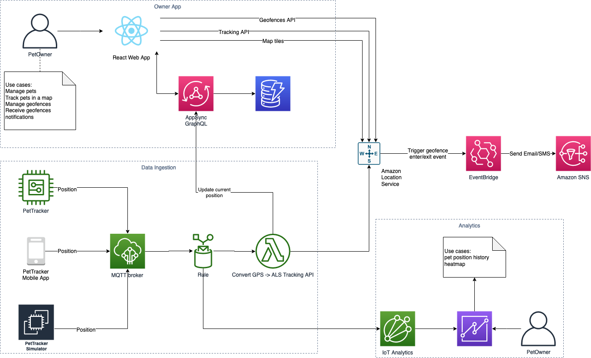

# PetTracker Demo

The **PetTracker Demo** is a cloud native application built using an serverless architecture based on AWS services to show case [AWS IoT](https://aws.amazon.com/iot/) integrations for geospatial use cases in conjuction with the [Amazon Location Services](https://aws.amazon.com/location/) to help Solution Architects around the world to make use of it in their demos and workshops.

## Architecture Diagram

## Technology Stack

* [IoT Core](https://aws.amazon.com/iot-core/)
* [IoT Analytics](https://aws.amazon.com/iot-analytics/)
* [AWS Lambda](https://aws.amazon.com/lambda/)
* [Amazon Location Service](https://aws.amazon.com/location/)
* [AWS AppSync](https://aws.amazon.com/appsync/)
* [AWS Amplify](https://aws.amazon.com/amplify/)
* [Amazon DynamoDB](https://aws.amazon.com/dynamodb/)
* [Amazon EventBridge](https://aws.amazon.com/eventbridge/)
* [Amazon Simple Notification Service](https://aws.amazon.com/sns/)

## Contributions

To contribute with improvements and bug fixes, please clone this repository and file a PR.

## License

This project is licensed under the Apache-2.0 License.