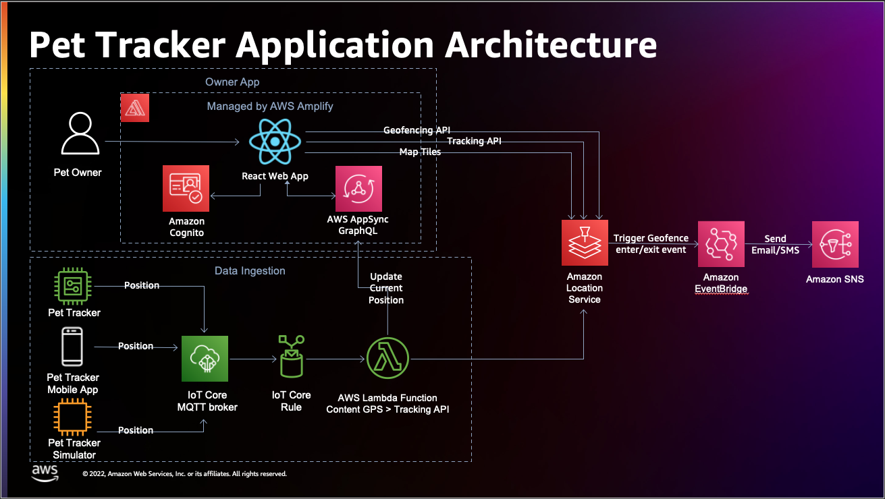

# Amazon Location Service PetTracker Demo

The **PetTracker Demo** is a cloud native application built using an serverless architecture based on AWS services to show case [AWS IoT](https://aws.amazon.com/iot/) integrations for geospatial use cases in conjuction with the [Amazon Location Services](https://aws.amazon.com/location/) to help Solution Architects around the world to make use of it in their demos and workshops.

## Architecture Diagram

## How to install

If you want to build the application, follow this guided workshop: [https://catalog.workshops.aws/how-to-build-a-pet-tracker/en-US](https://catalog.workshops.aws/how-to-build-a-pet-tracker/en-US).

## Contributions

To contribute with improvements and bug fixes, see [CONTRIBUTING](CONTRIBUTING.md).

## Security

See [CONTRIBUTING](CONTRIBUTING.md#security-issue-notifications) for more information.

## License

This library is licensed under the MIT-0 License. See the [LICENSE](LICENSE) file.
