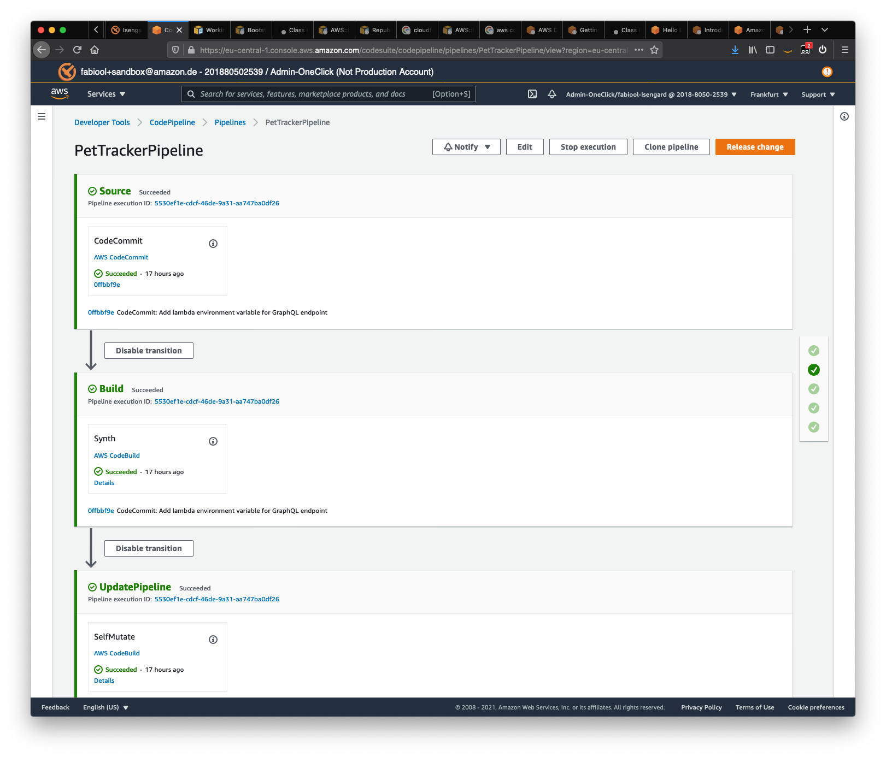

# Welcome Amazon Location Service workshop CDK!

This is the CDK code to deploy the Amazon Location Service workshop on any account.

## How to deploy this stack?

This stack uses the new [CDK Pipeline](https://docs.aws.amazon.com/cdk/latest/guide/cdk_pipeline.html), so when you deploy this stack, not only all the required resources are deployed, but also a new CI/CD pipeline is created that will monitor the code repository for changes and apply them as configured.

To bootstrap the CI/CD pipeline, follow the [CDK Pipeline](https://docs.aws.amazon.com/cdk/latest/guide/cdk_pipeline.html) instructions. Below a short summary:

1. Create a CodeCommit repository in the region you are planning to use for the workshop resources with a clone of the main source code. Use the name _iot-workshop-for-pet-tracking-and-geofencing_. If you are using GitLab, you can use the [Repository mirroring](https://docs.gitlab.com/ee/user/project/repository/repository_mirroring.html) instructions to keep the new repo and the source in sync.

1. Use an Administractor user to bootstrap your AWS environment:

```shell
export CDK_NEW_BOOTSTRAP=1 
npx cdk bootstrap --profile ADMIN-PROFILE \
    --cloudformation-execution-policies arn:aws:iam::aws:policy/AdministratorAccess \
    aws://ACCOUNT-ID/REGIONREGION-1
```

1. The CDK creates a new pipeline, which stays up-to-date with the source code repository.



## Some other useful commands

 * `npm run build`   compile typescript to js
 * `npm run watch`   watch for changes and compile
 * `npm run test`    perform the jest unit tests
 * `cdk deploy`      deploy this stack to your default AWS account/region
 * `cdk diff`        compare deployed stack with current state
 * `cdk synth`       emits the synthesized CloudFormation template
